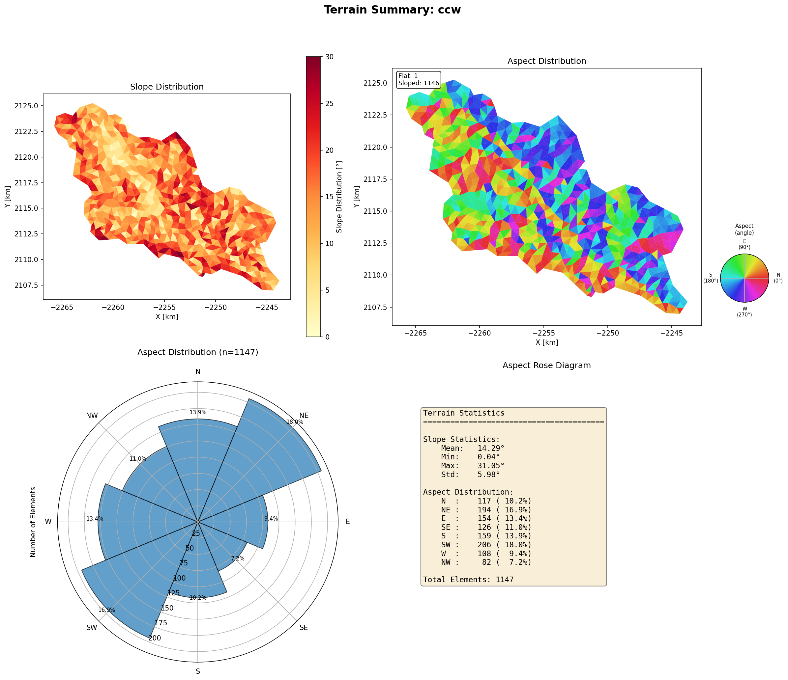
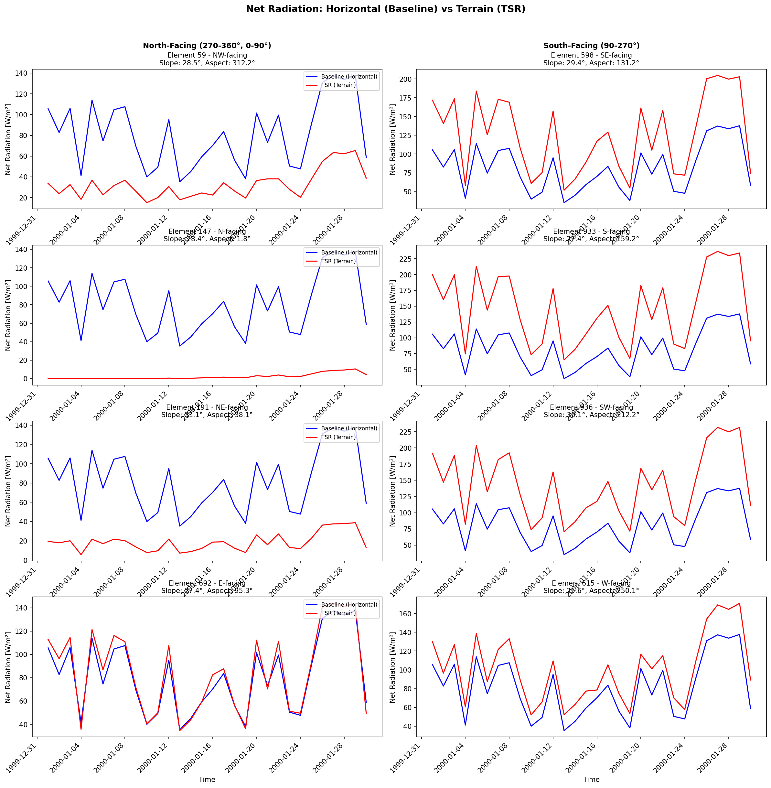
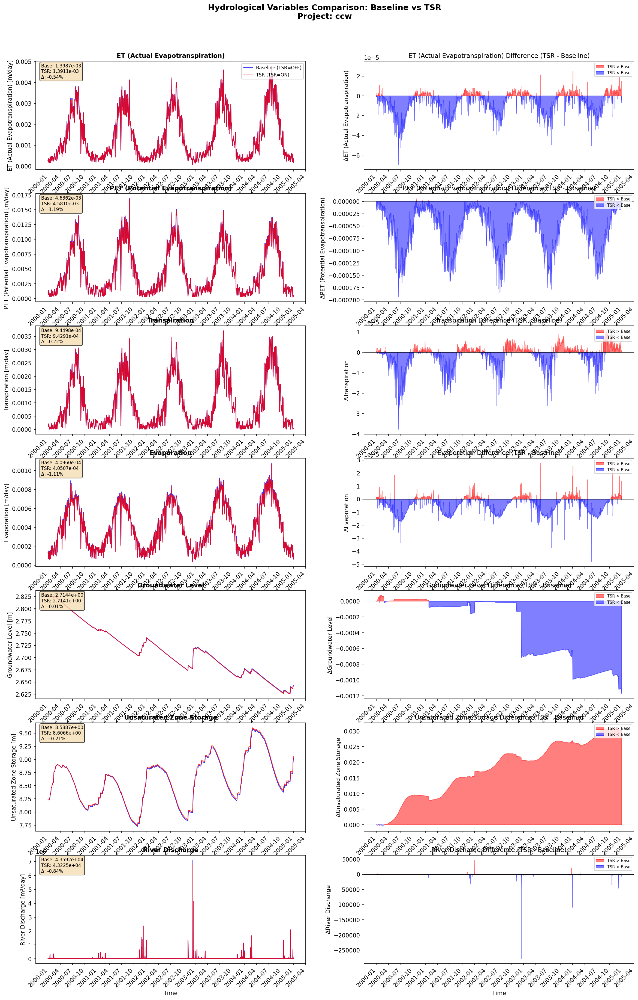
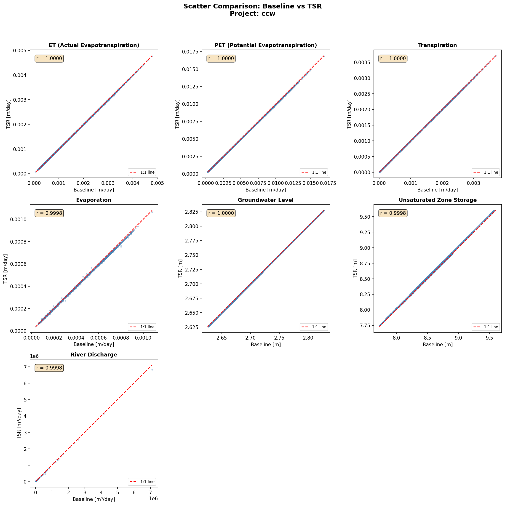
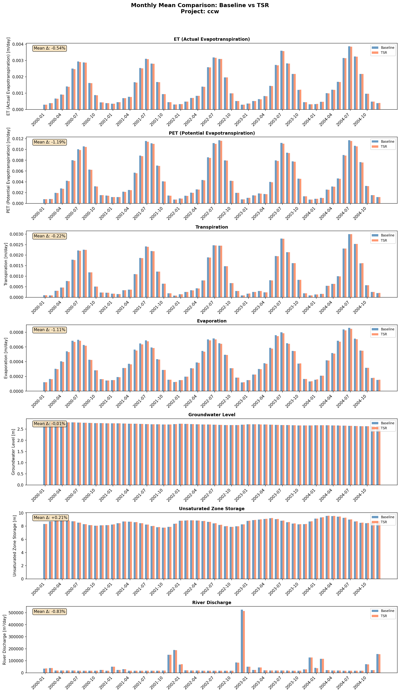

# SHUD v2.1 TSR 版本升级总结报告（CCW 研究区，1827 天模拟）

**项目名称**：Simulator of Hydrologic Unstructured Domains（SHUD）  
**版本主题**：v2.1 Terrain Solar Radiation（TSR）模块引入与效果验证  
**研究区**：CCW（Cache Creek Watershed）  
**模拟时段**：1827 天  
**数据来源**：`post_analysis/TSR_Analysis_Report.md`、`post_analysis/tsr_comparison_results.csv`、`VersionUpdate.md`、`docs/TSR_Technical_Reference.md`  

---

## 1. 封面与概述（项目名称、研究区CCW、模拟时段1827天）

地形起伏显著的流域中，坡度与坡向会显著改变地表接收短波辐射的入射几何关系，从而影响潜在/实际蒸散发、土壤水分与径流形成。SHUD v2.1 在 v2.0 的基础上新增 Terrain Solar Radiation（TSR）模块，以坡度—坡向—太阳位置为核心，对强迫场短波辐射进行地形几何修正，并提供诊断输出与验证工具链。

本报告围绕 CCW 研究区开展 1827 天连续模拟，采用“TSR 关闭（基准）/TSR 开启（升级）”对比实验，汇总 v2.1 TSR 的升级要点、地形特征、辐射修正效果与水文响应，并给出机制解释与后续建议。

---

## 2. 升级内容摘要（TSR模块功能、6个新参数、3个诊断输出）

### 2.1 TSR 模块功能与方法框架

根据 `docs/TSR_Technical_Reference.md`，TSR 的核心思想是用地形几何因子修正短波辐射：

$$
R_{n,t} = R_{n,h} \times f_{TSR}
$$

其中 $R_{n,h}$ 为水平面短波辐射（forcing 原值或指定模式输入），$R_{n,t}$ 为地形修正后辐射；$f_{TSR}$ 由斜坡入射角余弦与太阳天顶角余弦的比值构成（并通过阈值与上限抑制数值发散）：

$$
f_{TSR} = \frac{\cos\theta}{\cos Z}
$$

### 2.2 新增配置参数（6 个）

依据 `VersionUpdate.md` 与 `docs/TSR_Technical_Reference.md`，SHUD v2.1 新增 6 个与 TSR 相关的配置参数（位于 `*.cfg.para`）：

| 参数 | 默认值 | 本次实验设置 | 单位/类型 | 作用与说明 |
|---|---:|---:|---|---|
| `TERRAIN_RADIATION` | 0 | 1 | 0/1 | 是否启用 TSR（0=关闭，1=启用） |
| `SOLAR_UPDATE_INTERVAL` | 60 | 60 | 分钟 | 太阳位置更新间隔 |
| `RAD_FACTOR_CAP` | 5.0 | 5.0 | - | TSR 因子上限，限制极端几何放大 |
| `RAD_COSZ_MIN` | 0.05 | 0.05 | - | cos(Z) 下限截断，抑制日出/日落附近发散 |
| `RADIATION_INPUT_MODE` | `SWDOWN` | `SWDOWN` | 枚举 | 辐射输入模式（`SWDOWN`=下行短波；`SWNET`=净短波） |
| `SOLAR_LONLAT_MODE` | `FORCING_FIRST` | `FORCING_FIRST` | 枚举 | 太阳经纬度来源（`FORCING_FIRST`/`FORCING_MEAN`/`FIXED`） |

> 说明：当 `SOLAR_LONLAT_MODE=FIXED` 时，需要额外提供 `SOLAR_LON_DEG`/`SOLAR_LAT_DEG`（见技术参考文档）。

### 2.3 新增诊断输出（3 个）

当 `TERRAIN_RADIATION=1` 且相关输出开关满足条件（见 `docs/TSR_Technical_Reference.md`）时，模型额外输出三类诊断文件：

| 文件 | 变量含义 | 单位 | 诊断用途 |
|---|---|---|---|
| `*.rn_h.dat` | 水平面短波辐射 R_n,h | W/m² | 与 forcing 输入一致，用作对照基线 |
| `*.rn_t.dat` | 地形修正短波辐射 R_n,t | W/m² | 检查 TSR 是否生效及其量级 |
| `*.rn_factor.dat` | 几何因子 f_TSR | - | 分析增强/削弱的空间与时间分布 |

---

## 3. 研究区地形特征分析（引用 figures/ccw_terrain_summary.png）

CCW 研究区基于三角网格（共 1147 个单元）提取坡度与坡向特征，统计结果见图 3-1。总体而言，研究区以中等坡度为主，坡向分布呈现明显的各向异性，为 TSR 产生空间差异提供了地形基础。

**坡度统计（单位：°）**：
- 均值：14.29；标准差：5.98；最小值：0.04；最大值：31.05

**坡向统计（按 8 个象限分组）**：
- N：10.2%，NE：16.9%，E：13.4%，SE：11.0%
- S：13.9%，SW：18.0%，W：9.4%，NW：7.2%



*图3-1 CCW 研究区地形统计结果。左上为坡度空间分布，右上为坡向空间分布，左下为坡向玫瑰图，右下为统计汇总。*

---

## 4. TSR辐射修正效果（引用 figures/ccw_radiation_comparison.png，辐射增强42.2%，削弱57.8%，最大2.09x）

基于 `post_analysis/TSR_Analysis_Report.md` 的诊断统计，TSR 使短波辐射在“单元—时刻”尺度上呈现明显的增强/削弱并存特征，并在全流域平均意义下略偏向削弱。

### 4.1 诊断统计与量级

| 指标 | 数值 |
|---|---:|
| 水平面辐射均值 R_n,h | 220.91 W/m² |
| 地形修正辐射均值 R_n,t | 216.62 W/m² |
| 流域平均相对变化 (R_n,t - R_n,h) / R_n,h | -1.94% |
| 辐射增强比例（R_n,t / R_n,h > 1） | 42.2% |
| 辐射削弱比例（R_n,t / R_n,h < 1） | 57.8% |
| 最大增强倍数 | 2.09× |

### 4.2 典型坡向单元的时间序列对比

图 4-1 对不同坡向代表性单元（较大坡度）给出前 30 天的辐射对比：南向及偏南坡在特定时段表现为显著增强，而北向及偏北坡在多数时段表现为削弱。该结果与北半球太阳路径（太阳多位于南侧）所导致的背阳坡入射几何不利性一致。



*图4-1 典型坡向单元的短波辐射时间序列对比：蓝线为水平面辐射，红线为地形修正辐射。*

---

## 5. 水文变量响应分析（引用 hydro_comparison、scatter、monthly 图，ET -0.54%，PET -1.19%，Q -0.84%，土壤水 +0.21%）

TSR 通过改变短波辐射有效输入，首先影响潜在蒸散发（PET），并进一步传导至实际蒸散发（ET）、土壤水储量及径流过程。基于 `post_analysis/tsr_comparison_results.csv` 对关键输出的总体均值对比，得到如下量化响应（以基准为参照）。

### 5.1 关键变量总体变化（均值对比）

| 变量（输出项） | 基准均值 | TSR均值 | 相对变化 |
|---|---:|---:|---:|
| ET（实际蒸散发，`eleveta`） | 1.399e-03 m/day | 1.391e-03 m/day | **-0.54%** |
| PET（潜在蒸散发，`elevetp`） | 4.636e-03 m/day | 4.581e-03 m/day | **-1.19%** |
| Q（河道流量，`rivqdown`） | 5.555e+03 m³/day | 5.509e+03 m³/day | **-0.84%** |
| 土壤水（非饱和带水量，`eleyunsat`） | 8.589e+00 m | 8.607e+00 m | **+0.21%** |

> 注：上述“均值”按对应 `.dat` 输出矩阵（时间×空间单元/河段）对所有有效值平铺统计得到，用于刻画整体量级变化；时间序列图与月均值图则进一步展示其在时间维度上的一致性与季节性差异。

### 5.2 时间序列对比与差异分解（hydro_comparison）

图 5-1 给出 ET、PET、蒸发、蒸腾、地下水位、非饱和带水量与河道流量的时间序列对比及差值面板。总体上，TSR 与基准结果高度一致，但差值面板显示蒸散发相关变量存在系统性负偏差，与辐射平均削弱（-1.94%）相一致。



*图5-1 水文变量对比：左列为基准与 TSR 的时间序列，右列为差值（TSR−基准）。*

### 5.3 散点一致性检验（scatter）

图 5-2 的 1:1 散点对比显示，各变量点云紧贴 1:1 线，相关系数接近 1，表明 TSR 引入后的数值稳定性良好；变化主要体现为小幅系统偏移而非结构性失真。



*图5-2 各变量散点对比与 1:1 线。点云整体沿 1:1 线分布，说明升级未引入异常偏差。*

### 5.4 月尺度响应与季节性（monthly）

图 5-3 展示月均值对比。蒸散发相关变量在多数月份呈现一致的负偏差，而非饱和带水量呈现轻微正偏差，提示 TSR 影响具有季节调制：在太阳辐射较强的季节，地形几何差异更易放大短波输入的空间非均匀性，进而对 ET/PET 形成更可辨识的月尺度信号。



*图5-3 月尺度均值对比。蒸散发相关变量总体略降，土壤水储量略升。*

---

## 6. 物理机制解释（北坡主导→辐射削弱→蒸散发减少→土壤水增加）

综合地形统计与辐射诊断，可将 CCW 研究区的 TSR 影响机制概括为以下链式过程：

1. **北坡（及偏北坡）在太阳路径下更易处于背阳几何条件**：在北半球，太阳多数时间位于南侧天空；当单元坡向指向北侧或偏北侧时，cos(θ) 相对 cos(Z) 更可能减小，导致 f_TSR < 1。  
2. **“削弱”在单元—时刻组合上占优**：诊断表明辐射削弱比例为 57.8%，高于增强比例 42.2%，使流域平均短波辐射降低 1.94%。  
3. **辐射削弱 → PET/ET 降低**：短波辐射减少降低可用能量，PET 首先下降（-1.19%），并传导至 ET（-0.54%）。  
4. **蒸散发减少 → 土壤水增加并影响径流**：ET 降低使非饱和带水量略有增加（+0.21%），并伴随河道流量小幅降低（-0.84%），符合能量—水分耦合与水量平衡的一致性预期。

上述过程体现了 TSR 在山区流域中通过“能量约束”影响蒸散发与土壤水、并进一步影响汇流的典型路径。

---

## 7. 结论与建议

### 7.1 主要结论

1. **TSR 模块在 SHUD v2.1 中已成功集成并可诊断验证**：新增诊断输出（`rn_h`/`rn_t`/`rn_factor`）可直接用于判别 TSR 是否生效及其时空量级。  
2. **辐射修正呈现“增强/削弱并存、整体略削弱”的特征**：增强 42.2%，削弱 57.8%，最大增强 2.09×，全流域平均辐射降低约 1.94%。  
3. **水文响应幅度小但方向一致且物理合理**：PET、ET 与 Q 均呈小幅下降（-1.19%、-0.54%、-0.84%），土壤水略升（+0.21%），与“辐射削弱—蒸散发降低—土壤水增加”的机制一致。

### 7.2 建议与后续工作

1. **应用建议**：对地形起伏显著、辐射驱动敏感的流域建议默认开启 TSR；对地形平坦区可关闭以节省计算成本。  
2. **敏感性与可迁移性评估**：建议在不同纬度/坡向结构的流域开展对比，以量化“地形结构—辐射修正—水文响应”的可迁移规律。  
3. **模型改进方向**（见 `docs/TSR_Technical_Reference.md` 的限制说明）：可进一步引入地形遮蔽/地平线阻挡、单元级太阳位置差异、更精细的时区与时间语义处理，以提升复杂地形下的物理一致性。

---

## 8. 附录（配置参数表、源码入口）

### 8.1 本次实验 TSR 配置参数（`*.cfg.para`）

```
TERRAIN_RADIATION        1
SOLAR_UPDATE_INTERVAL    60
RAD_FACTOR_CAP           5.0
RAD_COSZ_MIN             0.05
RADIATION_INPUT_MODE     SWDOWN
SOLAR_LONLAT_MODE        FORCING_FIRST
```

### 8.2 TSR 相关源码入口与功能定位

依据 `docs/TSR_Technical_Reference.md`，TSR 的主要代码入口与职责如下：

| 路径 | 模块职责（摘要） |
|---|---|
| `src/ModelData/MD_ET.cpp` | 辐射读取与 TSR 因子应用，影响 PET/ET 计算链 |
| `src/Equations/SolarRadiation.cpp` | 太阳位置计算与地形几何因子 f_TSR 估计 |
| `src/classes/Element.cpp` | 单元地形信息（法向量/坡度/坡向）计算与存储 |
| `src/classes/Model_Control.cpp` | 参数解析、运行模式记录与输出头信息增强 |
| `src/main.cpp` / `src/Model/shud.cpp` | 模型主入口与整体流程组织（版本集成位置） |

